# New ArcheryClock

A rebuild of [ArcheryClock](https://www.archeryclock.com/) 2.4 for a Windows or Mac computer driving
the range display. Same timing rules as the original (target rounds with A–F details and
AB-CD rotation, double ends, shoot-offs, alternating finals, 25m1P, manual lights, match-start
countdown), without the Arduino / K8055 / serial / network-broadcast parts, plus:

- **Themes** for the full-screen display: **Classic** (looks like ArcheryClock) and
  **Retro LED** (looks like the Lancaster / Chronotir physical LED timer). Add your own in
  `public/themes/`.
- A **web control and settings page** that works on the clock PC, a laptop, a tablet or a
  phone on the same network: big Start / Next / Pause / Stop / Emergency buttons, a live
  preview of the display, and every setting in plain English.

## Download

**[⬇ Download NewArcheryClock-0.1.2.zip](https://github.com/rlight/NewArcheryClock/raw/main/release/NewArcheryClock-0.1.2.zip)**
(Windows and Mac). Unzip it and follow `INSTALL.txt`: on Windows run `windows\install.bat`, on a Mac
right-click `mac/install.command` → Open.

## Screenshots

### Range display: Classic theme (looks like the original ArcheryClock)

| Shooting (CD) | Last 30 seconds | Between ends: time of day |
|---|---|---|
| 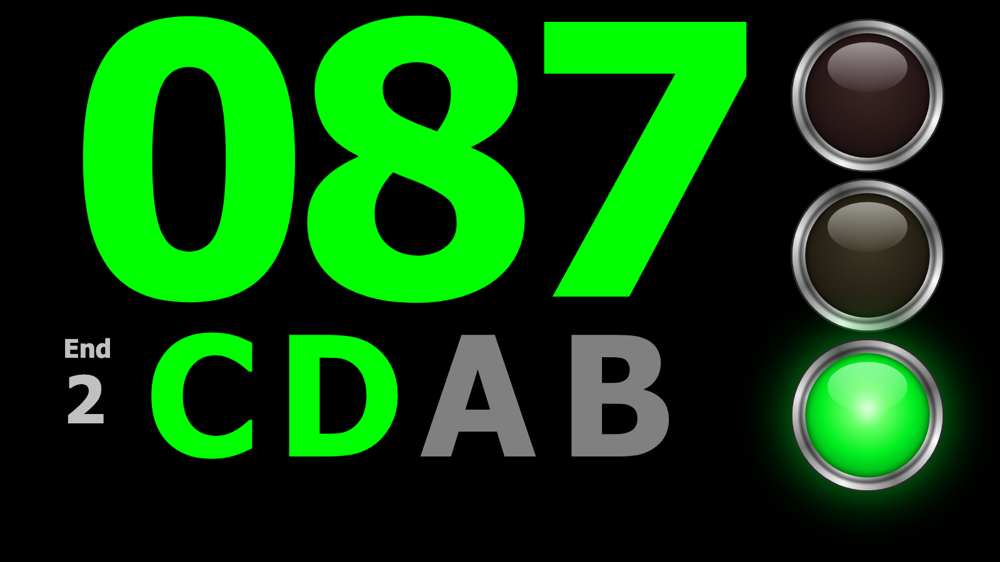 | 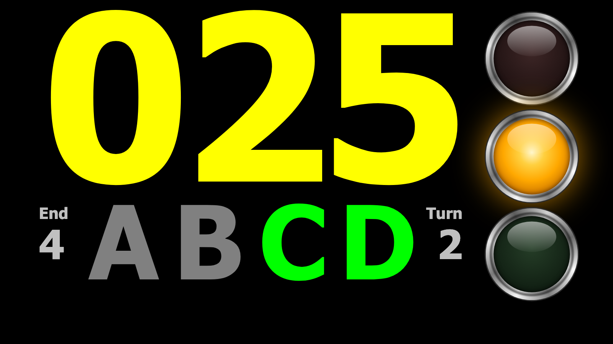 | 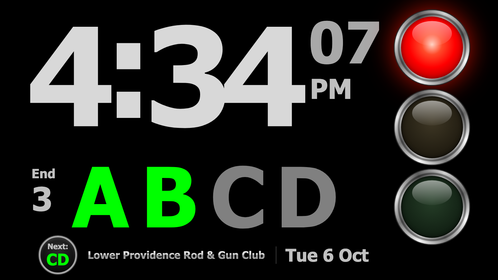 |
| **Match-start countdown** | **Emergency stop** | **Alternating finals** |
| 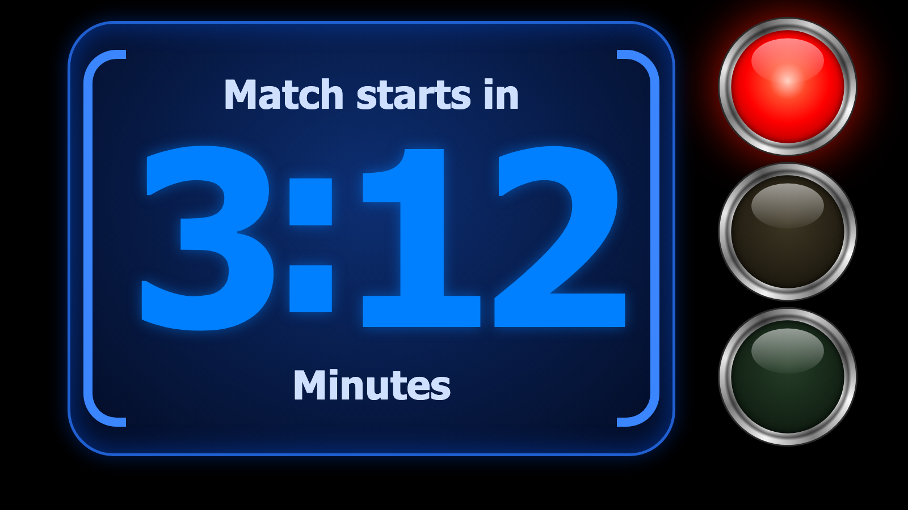 |  | 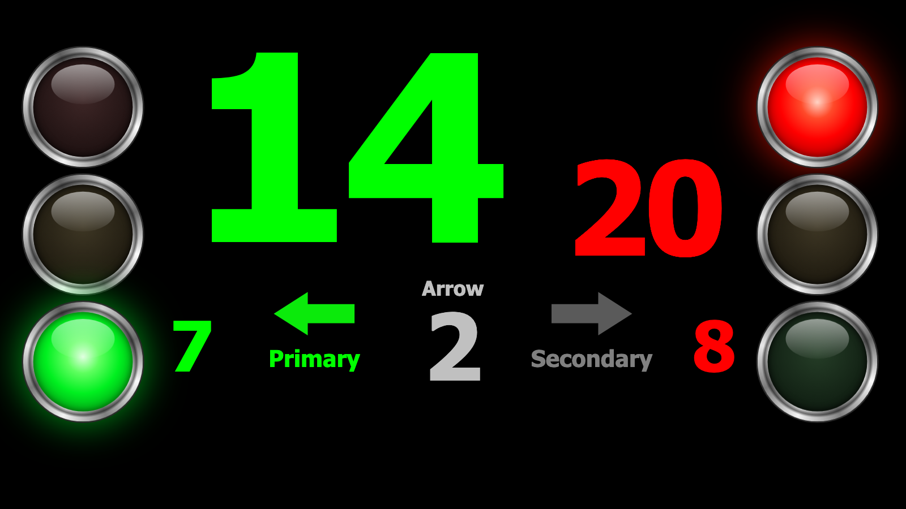 |

### Range display: Retro LED theme (looks like the Lancaster / Chronotir LED timer)

| Shooting (CD) | Between ends: time of day | Alternating finals |
|---|---|---|
| 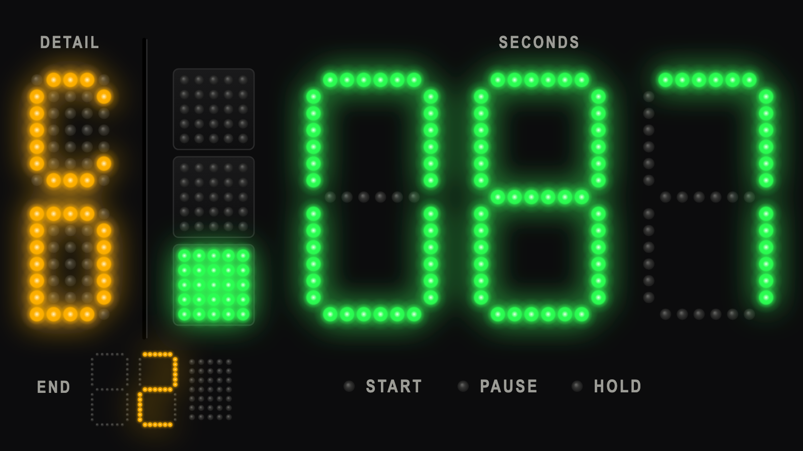 | 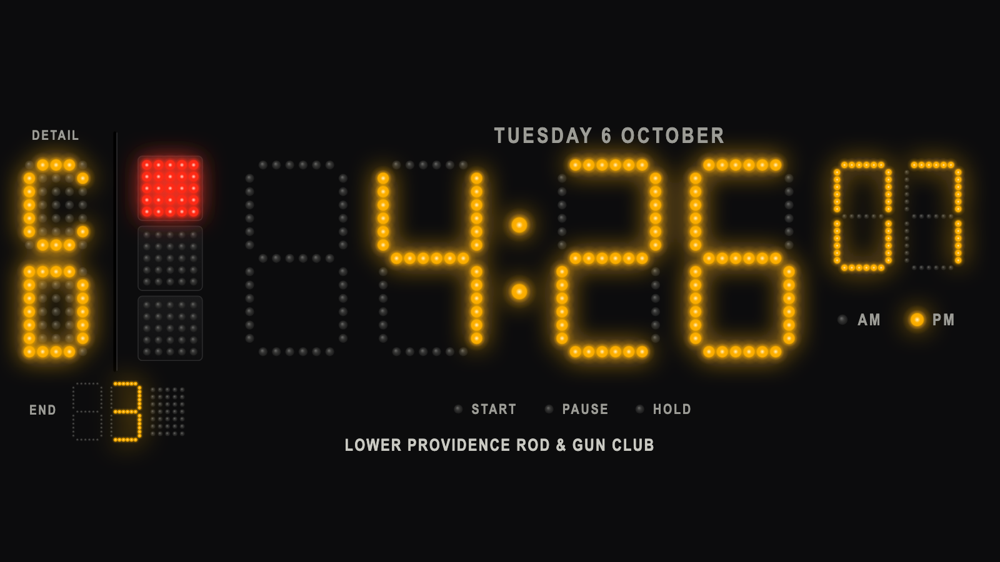 | 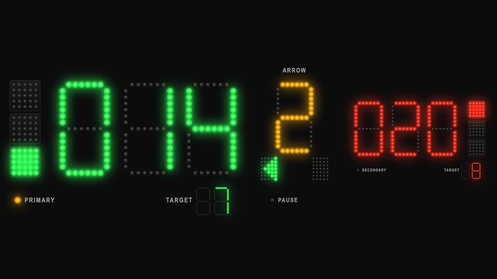 |

### National anthem

While the anthem plays, the display shows only a waving flag.


### Control page (any phone, tablet or computer on the network)

| Run the clock | Rounds and F-keys | On a phone |
|---|---|---|
| 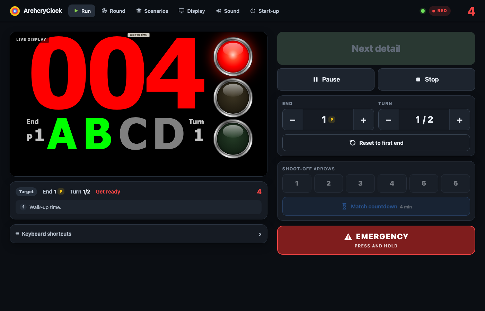 | 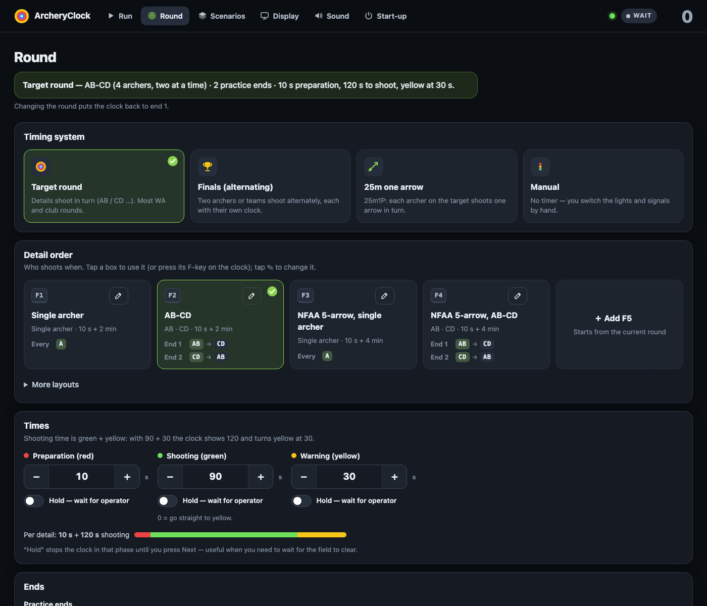 | 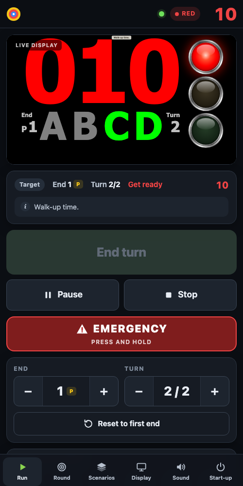 |

More screenshots of every state are in [`docs/screenshots/`](docs/screenshots/).

## Set up the clock computer (once)

Runs on **Windows 10/11** and **macOS**. Copy this folder to the computer, then:

| | Windows | Mac |
|---|---|---|
| Install | Double-click **`windows\install.bat`** (asks for admin rights). Installs Node.js if needed, opens port 8765 in the firewall for Private networks, adds an **Archery Clock** desktop shortcut, and can add it to start-up and stop the screen sleeping. | Double-click **`mac/install.command`**. Installs Node.js with Homebrew if needed (or points you to nodejs.org) and can start the clock at login. The first time a phone connects, allow `node` to accept incoming connections. |
| Start | **Archery Clock** shortcut (or `windows\start-clock.bat`) | `mac/start-clock.command` |
| Leave full screen | Alt+F4 | Cmd+Q |
| Stop everything | `windows\stop-clock.bat` | `mac/stop-clock.command` |
| Start with the computer | `windows\autostart-on.bat` (all users; asks for admin; off: `autostart-off.bat`) | run `mac/install.command` again and answer **y** |

The display opens full screen in kiosk mode in Edge (Windows) or Chrome/Edge (Mac; Safari works
but needs one click on the page before it plays sound). The computer is kept awake while the
clock runs.

**Auto-start not working?** Each launch adds a line to `data/start.log`; if nothing appears after a
reboot, it never ran. On Windows: run `windows\autostart-on.bat` (also fixes a shortcut left behind
after moving the folder), check *Settings → Apps → Startup* shows **Archery Clock** as On, and remember
it only runs after someone signs in. For an unattended PC, turn on automatic sign-in (`netplwiz`).

**Two monitors** (one at each end of the line): mirror the screens: on Windows *Settings →
System → Display → Duplicate these displays*; on a Mac *System Settings → Displays → Use as →
Mirror*. The clock shows on both.

## Updating

The clock checks GitHub for new versions when it starts and once a day. When one is available, the
control page shows an **Update** badge; *Start-up & connection → Updates* lists what's new with an
**Install update** button (only between ends). The clock restarts by itself in about 15 seconds.

- `data/` (settings, rounds, password) is never touched; the previous version is kept in `backup/`.
- If the new version doesn't start within 30 seconds, the old one is put back and started again.
- Optional: *Install updates automatically at start-up* installs a waiting update when the computer starts.
- Log: `data/update.log`. Copies that are git checkouts don't self-update (use `git pull`).
- Clocks running 0.1.0 don't have the updater yet: install 0.1.1 once by hand (unzip over the folder);
  later versions arrive through the button.

Publishing a new version (maintainer): add a section to `CHANGELOG.md`, then
`./scripts/make-release.sh --bump patch --publish` and commit/push.

## Use it

- Open the control page from any device on the same network: `http://<clock-computer-name>:8765/`
  (the exact addresses are on the control page under *Start-up & connection*, and are printed
  in `data/server.log`).
- **Password:** phones, tablets and other computers must sign in. The default password is
  **`archery`**: change it on the control page under *Start-up & connection → Password for other
  devices*. The clock computer itself never asks. A device stays signed in for 30 days; changing the
  password signs every other device out. Forgot it? On the clock computer, set a new one on that
  same page (no old password needed there), or delete `data/auth.json` to go back to `archery`.
- If port 8765 is taken, change `server.port` on the control page (*Start-up & connection*) and
  restart the clock.

### Keyboard (on the clock computer's display)

| Key | Action |
|---|---|
| Space | Start the end / next detail / finish early / resume |
| P | Pause / resume |
| S | Stop (repeats the current detail) |
| E | Emergency stop |
| PageDown / PageUp | Next / emergency (presenter remotes); in finals: choose right / left |
| 1–6 | Shoot-off with that many arrows |
| C | Match-start countdown |
| ↑ / ↓ | End + / − (finals: arrow counter) |
| → / ← | Detail + / − (finals: choose right / left side) |
| M | Seconds ↔ minutes |
| H | Hide / show labels and hints |
| F1–F12 | Load your saved scenario |
| Shift+F1–F12 | Load a built-in preset (Shift+F5 = AB-CD, the default) |
| R / Y / G | Manual mode: switch the light to red / yellow / green (with its signals) |
| 1 / 2 / 3 | Manual mode: send that many signals (other modes: shoot-off) |

## Themes

A theme is a folder in `public/themes/<id>/` with `theme.json` (name, description),
`theme.css` and `theme.js` (an ES module with `mount`, `render(snapshot)` and `unmount`).
The snapshot it receives is documented in [`docs/architecture.md`](docs/architecture.md).
New themes appear in the control page automatically. Try any theme without a server at
`/display/?mock=1&theme=<id>`.

## Sounds

The original ArcheryClock 2.6.1 signal sounds (buzzer1–8, beep1–7, horn1–6, bell1, flute1, oink1,
ploink1, whistle1) are in `public/sounds/custom/`. **Default** (`Default.wav`, 2.6.1's factory sound `ac1.wav`) is
selected out of the box and plays exactly as recorded, at full volume.
They are GPL v3 (see `ORIGINAL-SOUNDS.txt` there). The clock also has built-in synthesised
sounds (buzzer, beep, horn, whistle, bell, soft). To add your own recording, drop a `.wav` file
into `public/sounds/custom/` and pick it under *Sound*.

## National anthem

The *Run* tab has a **National anthem** panel: pick a version, **Play anthem**, **Stop anthem**,
and a volume slider. The clock computer plays it, and while it plays the display shows only a full-screen
waving U.S. flag, then returns to the clock. An emergency stop also stops the anthem. The four recordings of *The Star-Spangled
Banner* (solo soprano: U.S. Navy Band; choir with band: U.S. Army Field Band; choir and
instrumental: U.S. Air Force Band) are public domain, from Wikimedia Commons. Sources are in
`public/anthem/anthems.json`; add another version by dropping the file there and adding an entry.

## Music (private range)

Set *Start-up & connection → Location* to **Private range** and a **Music** panel appears at the
bottom of the *Run* page: **Open Amazon Music**, **⏮ / ⏯ / ⏭**. The clock computer sends its media
keys to whatever music app is playing on it (the Amazon Music app, Spotify, …), so music is chosen
in that app and controlled from your phone. Amazon has no public way for other programs to play its
music directly, so the clock can't see what's playing or pause it by itself — pause it before the
anthem or a whistle. On a Mac, the first press asks to allow Accessibility access for the clock.
Streaming services are licensed for personal use; playing music to club members may still need a
public-performance licence — that's the club's call.

## Development

```bash
npm start                     # node server/server.js  (PORT=… and ARCHERYCLOCK_DATA=… override)
npm test                      # engine tests (node:test)
./scripts/make-release.sh     # builds release/NewArcheryClock-<version>.zip + .sha256 (--bump patch, --publish = GitHub Release)
```

No npm packages are needed. `docs/original-spec.md` describes the original program's behaviour;
`docs/architecture.md` is the contract between the server, the display themes and the control page.
Settings and saved scenarios live in `data/` (not in git).

## Licence

GNU General Public License v3.0 (see `LICENSE`). Behaviour is modelled on ArcheryClock by Henk
Jegers (GPL v3); the original's signal sounds in `public/sounds/custom/` are used under the same
licence. The anthem recordings in `public/anthem/` are public domain (U.S. military bands).
